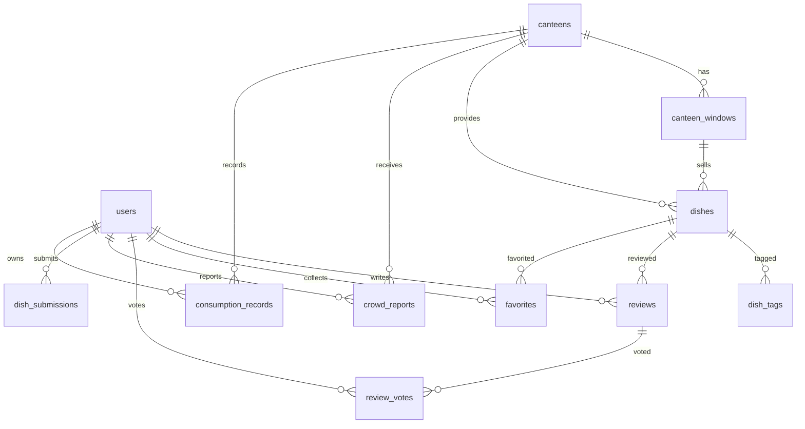

# 后端设计说明

## 模块划分

```text
controller  接收 Android 请求，返回统一 ApiResponse
service     处理业务逻辑、统计聚合、审核流、异常判断
mapper      MyBatis-Plus 数据访问层
entity      与 MySQL 表一一对应
security    JWT 解析、登录态注入、权限控制
dto         请求体和响应视图对象
```

## ER 图



## 核心业务逻辑

### 评分统计

菜品评分来自 `reviews` 中 `status = APPROVED` 的记录，后端在返回菜品卡片时动态计算：

```text
avgRating = approvedReviews.rating 的平均值
reviewCount = approvedReviews 数量
favoriteCount = favorites 数量
```

食堂评分由该食堂下所有已审核菜品的评论聚合得到，保证食堂排序和菜品详情页使用同一份数据来源。

### 推荐排序

当前版本使用可解释的权重排序，便于中期检查展示：

```text
score = avgRating * 10 + favoriteCount * 1.5 + reviewCount
```

后续可以把用户口味偏好、校园卡消费频次、当前位置距离加入该公式。

### 实时拥挤度

用户在食堂页上报 1-5 档拥挤度。后端只聚合最近 45 分钟的数据：

```text
crowdLevel = AVG(crowd_reports.level WHERE created_at >= now - 45min)
```

这样可以避免旧数据长期污染当前状态。

### 内容审核

用户上传菜品不会直接进入正式菜品表，而是写入 `dish_submissions`：

```text
PENDING -> APPROVED -> 写入 dishes + dish_tags
PENDING -> REJECTED -> 保存驳回原因
```

管理员接口统一挂在 `/api/admin/**`，必须具备 `ADMIN` 角色。

## 数据准确性与安全措施

- `reviews` 使用 `(dish_id, user_id)` 唯一约束，防止同一用户重复刷分。
- `favorites` 使用 `(user_id, dish_id)` 唯一约束，防止重复收藏。
- `review_votes` 使用 `(review_id, user_id)` 唯一约束，用户再次点赞会更新原投票。
- 菜品上传会校验食堂和窗口归属关系，避免“桃李园菜品挂到紫荆园窗口”。
- 密码只保存 BCrypt 哈希，接口永远不返回 `password_hash`。
- JWT 中只存用户 id、用户名和角色，敏感信息不进 token。
- 全局异常处理器把非法输入、未登录、无权限、重复提交统一转成稳定 JSON。
