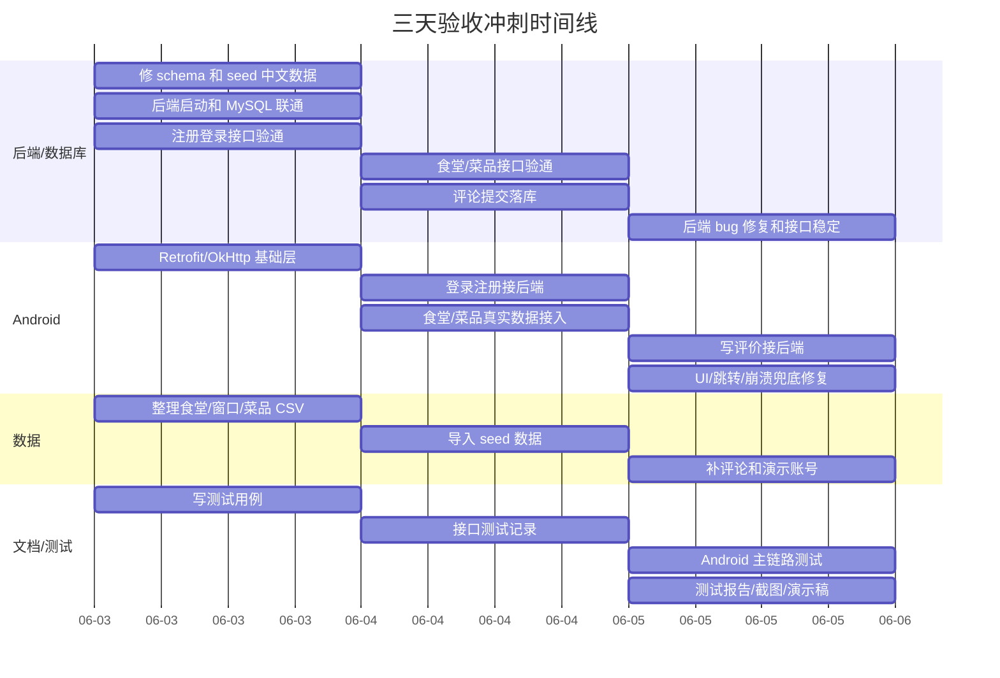
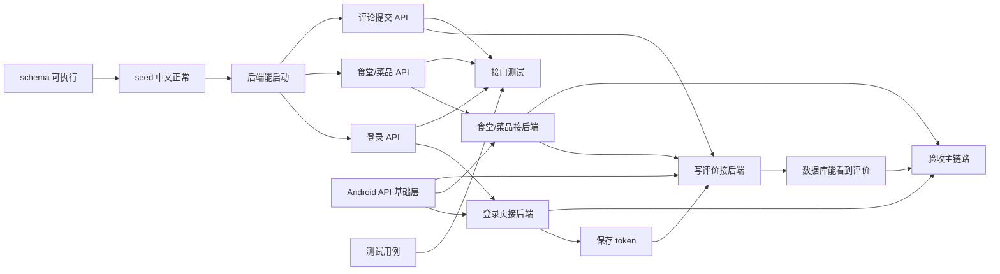

# 三天验收冲刺计划

本文档是三天版本的任务分析、时间线和 Git 分支建议。  
原则是：少开分支、快合并、优先跑通真实数据闭环。

## 目标

三天内最少要跑通：

```text
启动 App -> 登录 -> 加载真实食堂 -> 查看菜品详情 -> 写五星评价 -> 数据库能看到评价
```

如果这条链路能跑通，就能证明移动端、后端、数据库已经联通。  
其他功能可以保留、降级或作为后续计划说明。

## 三天内必须完成

## 1. 后端和数据库

必须完成：

- Spring Boot 能启动。
- MySQL 能连接。
- `schema.sql` 可执行。
- `seed.sql` 中文正常，不乱码。
- 至少有 7 个食堂、若干窗口、30 个左右菜品、若干评论。
- 注册/登录接口可用。
- 食堂列表接口可用。
- 菜品列表/详情接口可用。
- 写评价接口可用，并能落库。

可以降级：

- 图片上传暂时不做 multipart。
- 补充菜品可以先只写入 `dish_submissions`，或者保留前端静态提交提示。
- 收藏可以暂时不接后端。
- 管理员审核可以作为后续计划。

## 2. Android 前端

必须完成：

- 登录/注册页调用后端。
- 登录成功保存 token。
- 美食广场加载真实食堂列表。
- 食堂详情或菜品列表能加载真实菜品。
- 菜品详情能显示真实数据和评论。
- 写评价调用后端接口。
- 评价提交成功后前端能看到结果，数据库也能看到。
- 接口失败时不崩溃，保留 mock fallback。

可以降级：

- 图片没有 URL 时继续显示占位。
- tag 筛选可以前端本地做。
- 补充菜品表单可以先提交文字数据，不处理真实图片上传。

## 3. 文档和测试

必须完成：

- README：项目怎么运行。
- API 文档或 Swagger 截图。
- 数据库设计说明。
- 测试报告。
- 分工说明。
- 演示流程。

测试至少覆盖：

- 注册/登录。
- 食堂列表加载。
- 菜品详情加载。
- 写评价并落库。
- 网络失败或接口异常时不崩。

## 三天时间线



## 依赖拓扑图



## 三天关键路径


这条路径不能断。  
补充菜品、图片上传、收藏、地图都可以降级，但这条主链路最好不要降级。

## 三人分工建议

### A：后端/数据库

第一优先级：

- 修 `schema.sql`、`seed.sql`。
- 后端启动。
- 登录 API。
- 食堂/菜品 API。
- 评论提交 API。

第二优先级：

- 补充菜品提交。
- 图片 URL 静态访问。
- Swagger/API 文档。

### B：Android

第一优先级：

- Retrofit/OkHttp。
- 登录注册接后端。
- 食堂/菜品真实数据接入。
- 写评价接后端。
- mock fallback。

第二优先级：

- 补充菜品提交接后端。
- UI 细节修复。
- 真机/模拟器跑通。

### C：数据/测试/文档

第一优先级：

- 整理菜品数据。
- 修 seed 中文内容。
- 写测试用例。
- 做接口测试记录。
- 写测试报告。
- 准备演示流程。

第二优先级：

- 准备图片文件夹和命名规则。
- 截图/录屏。
- 整理分工说明。

## 四人分工建议

如果有 4 个人：

- A：后端接口和安全。
- B：Android 接口接入。
- C：数据、seed、图片路径、接口测试。
- D：文档、测试报告、演示、UI 小修。

## Git 分支建议

三天时间不要开太多分支。建议最多 5 个：

```text
main
├── backend-core
├── android-api
├── data-seed
├── docs-test
└── ui-polish
```

各分支职责：

### `backend-core`

负责：

- schema/seed 修复。
- 注册登录。
- 食堂/菜品接口。
- 评论提交接口。

要求：

- 每天至少合一次 `main`。
- 后端能启动后尽快合并，不要拖到最后。

### `android-api`

负责：

- Retrofit/OkHttp。
- 登录接后端。
- 食堂/菜品接后端。
- 写评价接后端。

要求：

- 如果后端接口没好，先按约定 DTO 写 mock fallback。
- 不要等后端完全完成才动手。

### `data-seed`

负责：

- 菜品 CSV。
- `seed.sql` 数据。
- 演示账号。
- 图片路径规则。

要求：

- 尽早合并，因为后端和前端都依赖真实数据。

### `docs-test`

负责：

- README。
- API 文档整理。
- 测试报告。
- 分工说明。
- 演示脚本。

要求：

- 可以全程并行，不要等最后一天才写。

### `ui-polish`

负责：

- UI 小修。
- 弹窗、导航、间距。
- 真机适配。

要求：

- 不改核心数据逻辑。
- 避免和 `android-api` 大面积冲突。

## 分支合并规则

简单规则：

```text
所有人每天开始前 pull main
新任务从 main 开分支
基础分支当天尽量合 main
不要互相 merge 对方分支
需要依赖时等对方合进 main，再从 main 更新
```

推荐合并顺序：

1. `data-seed`
2. `backend-core`
3. `android-api`
4. `ui-polish`
5. `docs-test`

实际情况可以交错，但原则是：

- 数据和后端基础越早合越好。
- Android API 接入不要长期脱离 `main`。
- 文档可以持续补。

## 不建议现在做的事

三天内不要优先做：

- 复杂管理员审核。
- 真正 multipart 图片上传。
- 地图/热力图完整实现。
- 复杂收藏体系。
- 复杂推荐算法。
- 大规模 UI 重构。
- 过细 Git 分支。

这些可以写进“后续计划”。

## 验收演示脚本

演示时按固定流程，不要现场自由探索：

```text
1. 打开 App，进入登录页
2. 登录测试账号
3. 进入首页，看公告和推荐
4. 进入美食广场，展示真实食堂列表
5. 搜索或筛选一个食堂
6. 进入食堂详情，展示楼层和菜品
7. 进入菜品详情，展示评论
8. 写一个五星评价
9. 返回后看到新评价
10. 展示后端接口或数据库中新增评价
```

如果补充菜品接口也完成，可以追加：

```text
11. 在食堂详情补充一个菜品信息
12. 展示后端收到提交记录
```

## 最后收口标准

三天结束时至少应该做到：

- App 能在手机或模拟器上跑。
- 后端能启动。
- MySQL 有真实中文数据。
- 登录能走后端。
- 食堂和菜品能从后端加载。
- 写评价能落库。
- 有测试报告和演示材料。

如果这些都做到，验收风险就会明显降低。
